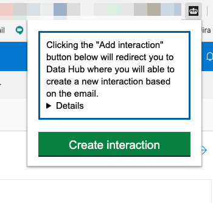

# Data Hub Interactions Browser Extension

This is a POC of a Chrome extension designed to speed-up creation of interactions
based on Outlook events.

It needs Sandbox running on port `8008` and data-hub-frontend on `3001`.

Check the [Chrome Getting Started Tutorial](https://developer.chrome.com/extensions/getstarted) for how to start.
